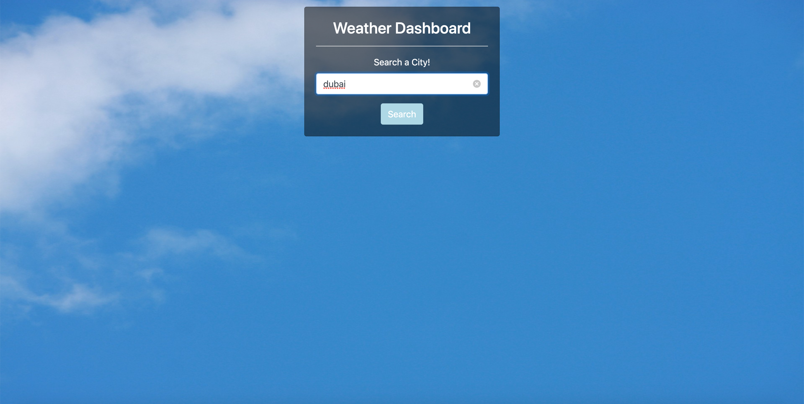
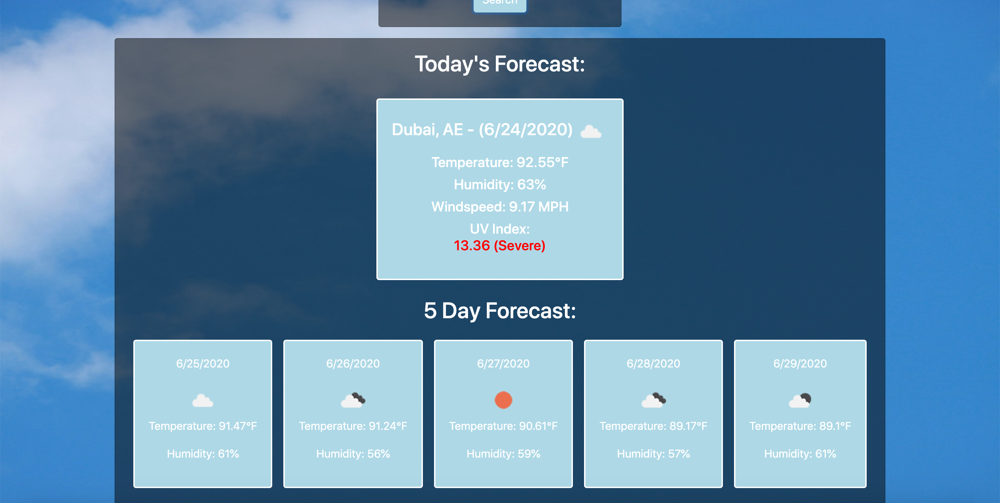

# Weather Dashboard

### Links:
Demo - [https://loganveik.github.io/weatherdashboard](https://loganveik.github.io/weatherdashboard)
Repo - [https://github.com/loganveik/weatherdashboard](https://github.com/loganveik/weatherdashboard)

### Description:
This is a front-end, simple weather app. You enter a city and you are displayed with the current forecast as well as a 5-day forecast.

### Technologies Used:
HTML5, CSS3, Bootstrap4, Javascript, jQuery, Openweathermap API.

### How to Use:
1) Once on the site, enter any city in the searchbar at the top.

2) Once searched, the current day forecast as well as the next 5-day forecast will be displayed
